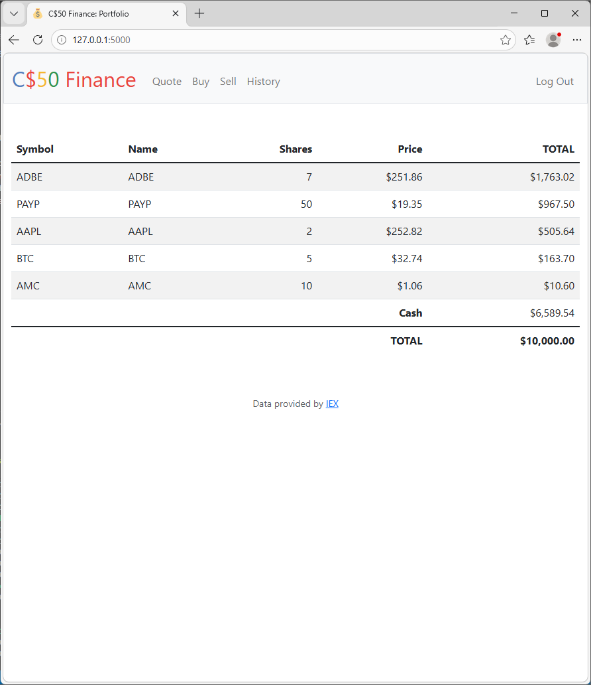
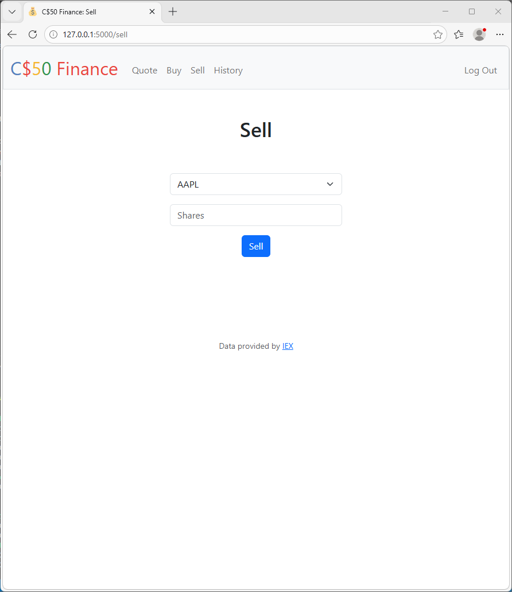
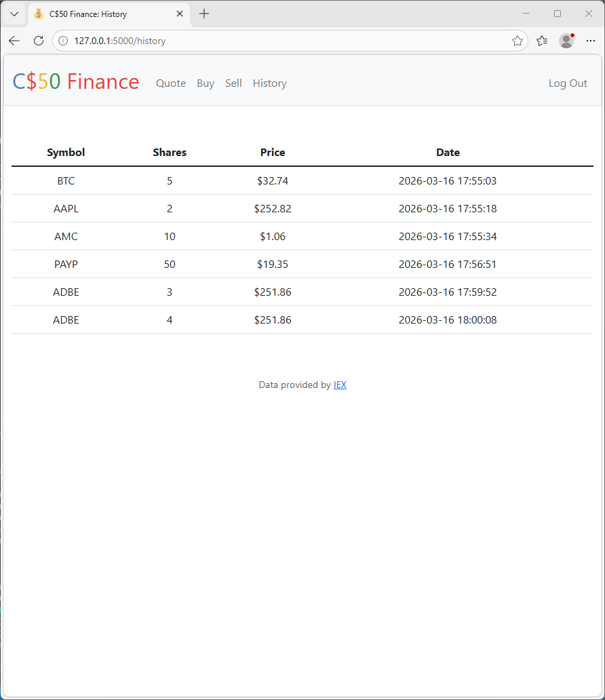

# Flask Finance Web App

A full-stack stock portfolio simulation web app built with Flask. Users can register, log in, look up real-time stock prices, buy and sell shares, and track their portfolio and transaction history.

Originally developed as part of Harvard’s CS50 course, this project was later revisited to improve API integration, refine data handling, and clean up application structure.

---

## Features

- User authentication (register, login, logout)
- Real-time stock quote lookup via external API
- Buy and sell shares with validation
- Portfolio dashboard with total value tracking
- Transaction history with timestamps
- SQLite database for persistent storage

---

## Screenshots

### Portfolio


### Sell Stock


### Transaction History


---

## What I Learned

- How to structure a full-stack Flask application
- Managing user sessions and authentication flows
- Designing and querying relational databases (SQLite)
- Integrating external APIs into a backend service
- Handling data validation and edge cases
- Debugging and improving an existing codebase

---

## Running the App

```bash
python -m venv venv
source venv/Scripts/activate
pip install -r requirements.txt
flask run